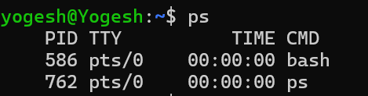
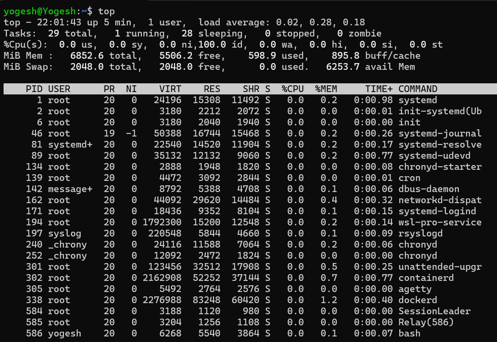
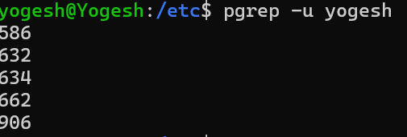
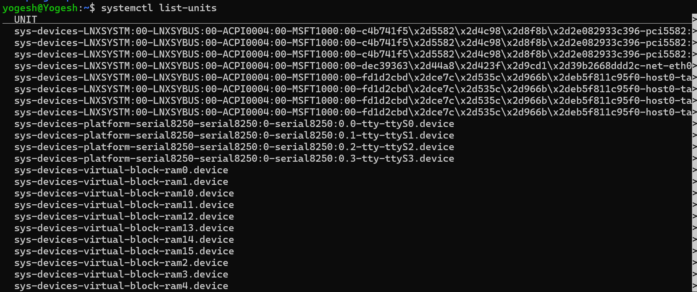
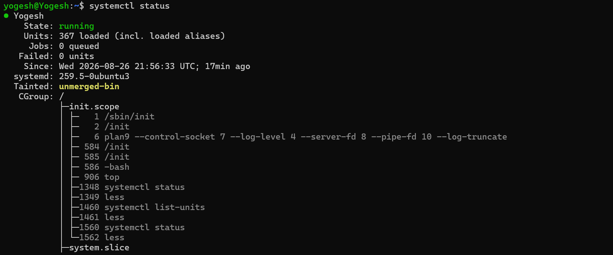
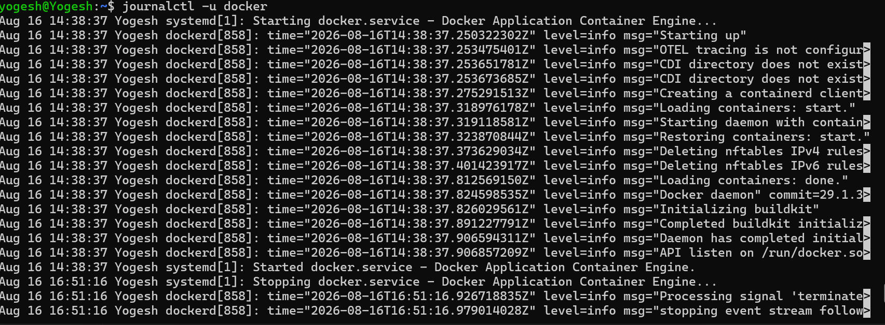
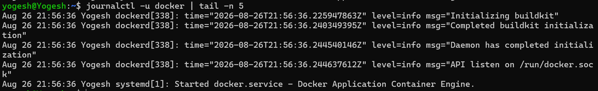

# check running processes
### ps command

### top command
 
 

### pgrep command

## Inspect one systemd service

### systemctl list-units

### systemctl status

## Capture a small troubleshooting flow

### journalctl -u docker

### journalctl -u docker | tail -n 5

