# linux-troubleshootiing runbook

### Environment Basis

1. uname -a

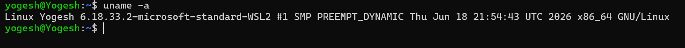

2. lsb_release -a

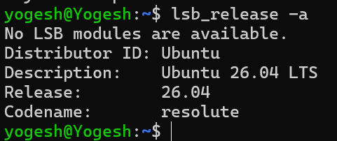

### file system sanity

1. mkdir /tmp/runbook-demo, cp /etc/hosts /tmp/runbook-demo/hosts-copy && ls -l /tmp/runbook-demo

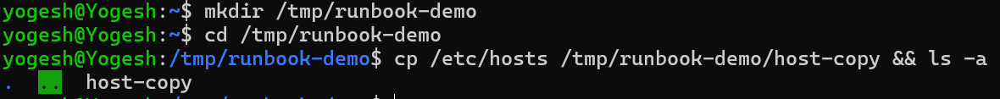

### Snapshot: CPU & Memory

1. top

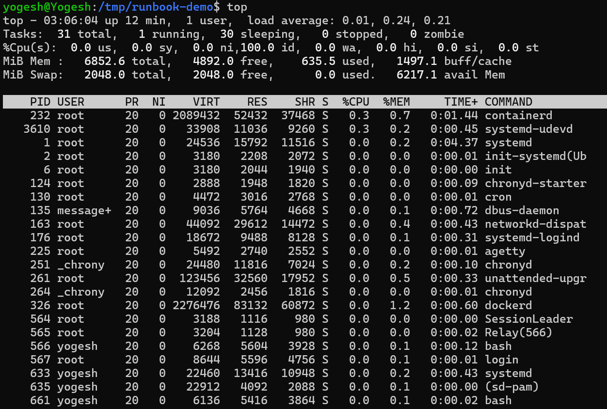

2. ps -o pid

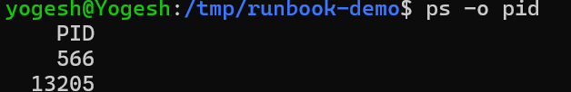

### Disk /IO

1. df -h 

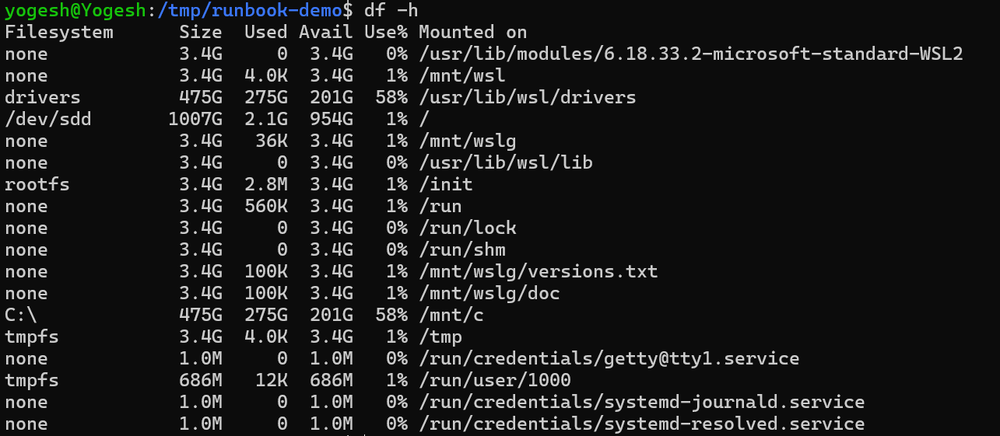

2. du -sh
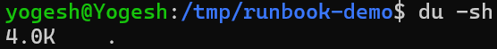

### Networks
 
1. ss -tulpn

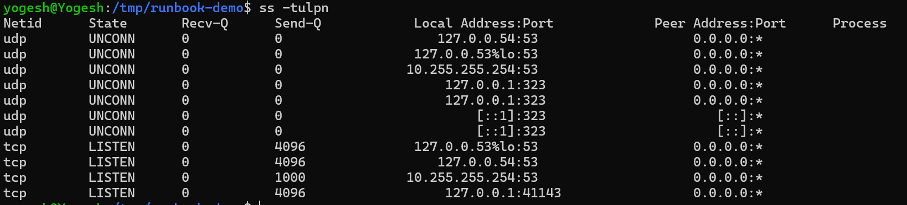

2. netstat -tulpn

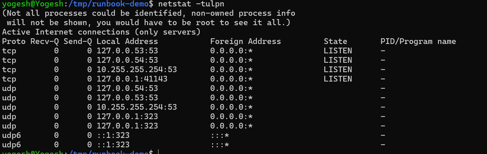

### Logs

1. journalctl -u docker -n 50

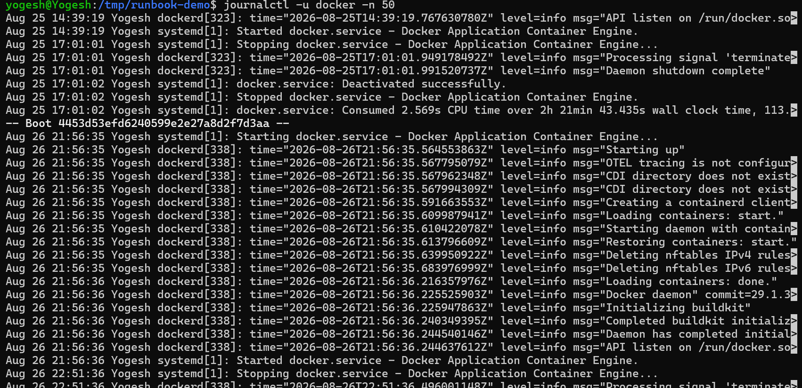

2. tail -n 50 auth.log

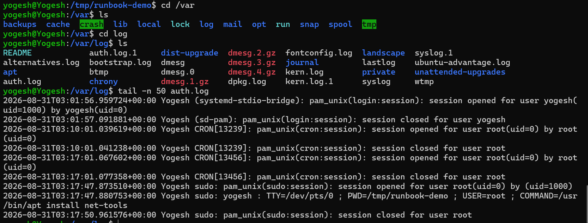