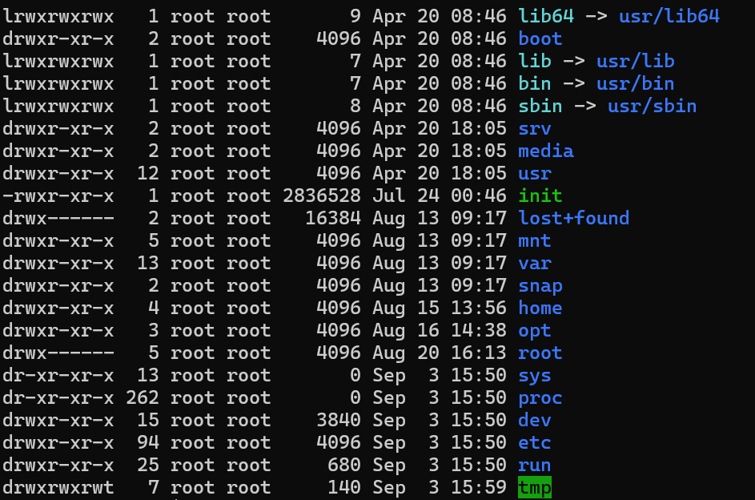
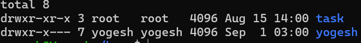
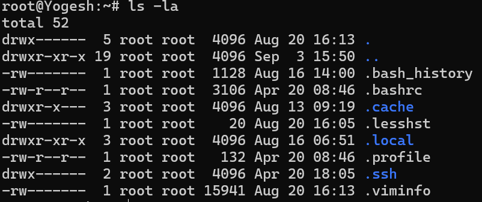
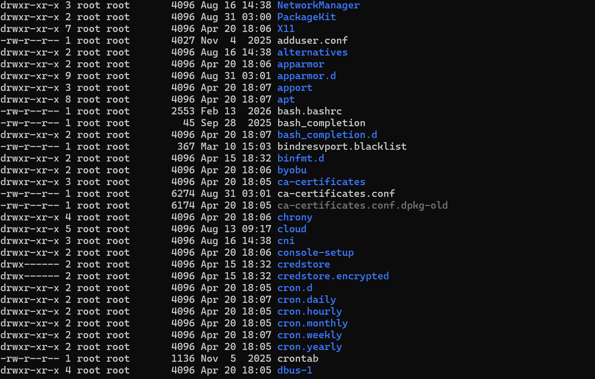
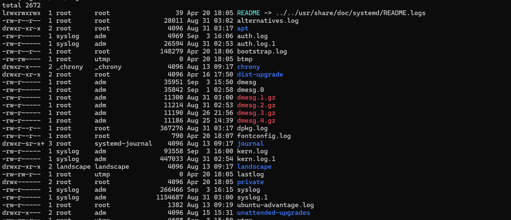
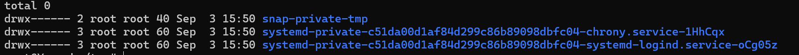
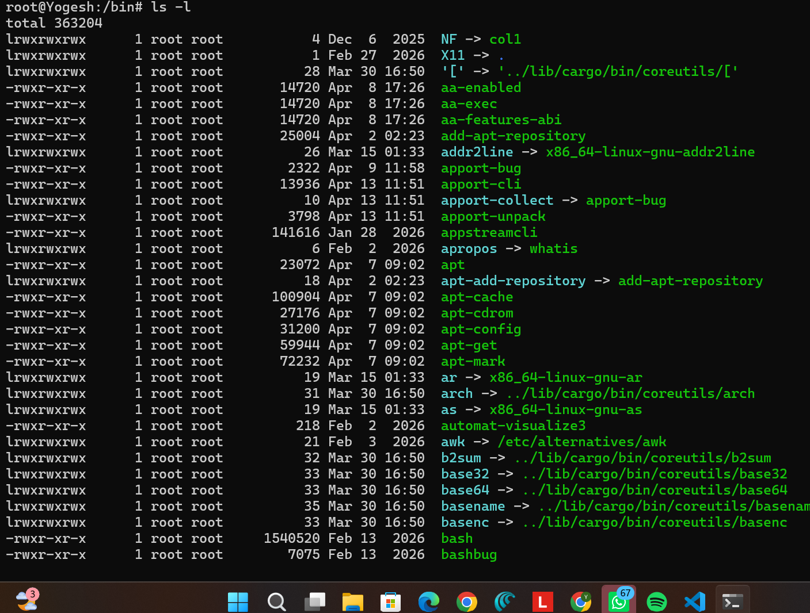
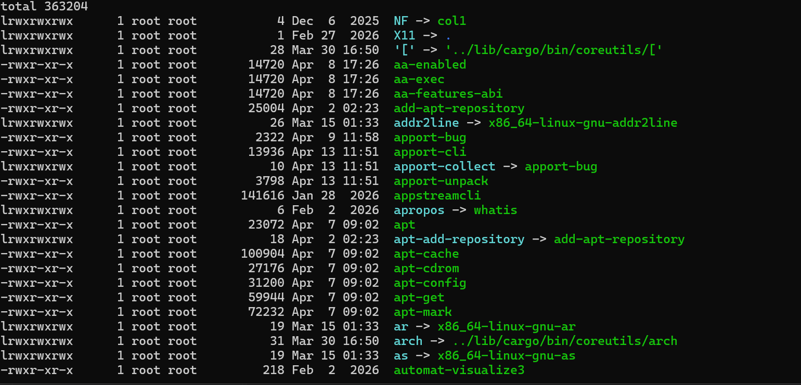
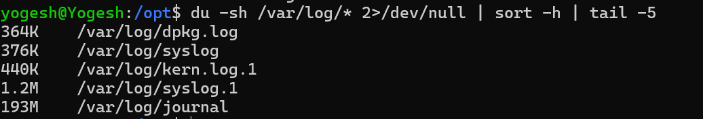
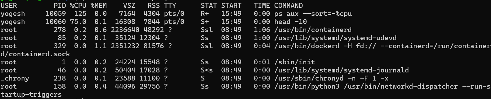

                     # Core Directories

## /

what does it contains:- It contains all the files and directories in the linux or unix system.

I will use this to access the files and directories inside this directory.

## /home

what does it contain:- it contain user home directories.

I will use it to access files and directories related to user.

## /root

 what does it contains: it contains the files and directories of root user configurations. It can only be accessed by the super user 

 

 I will use this directory to store ujkllllllllllllllm,   bhhhhhhhhhhhh,k,k,,nnn njlkm,ser specific confiurations.

## /etc

what does it contains:- it contains the configuration file related to application and programs or service.

I will use this directory to edit configs or store new config related to application, service or program.

## /var/log

what does it contains:- It contains logs related to application, service or program. 

I will use this directory to store the logs or fetch the log related to application, service or program.

## /tmp
 
what does it contains: It contains the temporary files created by user, application or system or program.

## /bin

what does it contains:- It contains essential binary executable files. It has fundamental commandline programs which is required  for system to boot, restart or opreate.

## /usr/bin

what does it contain:- It contains user executable binary file and user commands which are not needed in early stages of system boot.

## /opt

what does it contain:- it contains third party software packages.

# Part 2: Scenario-Based Practice

A web application service called 'myapp' failed to start after a server reboot.
What commands would you run to diagnose the issue?
Write at least 4 commands in order.

## Step 1: systemctl status myapp

why: First I will check is the service is running or not. Also I will get to know if the service is enabled or not

## Step 2: journalctl -u myapp -n 50
 
Why: from this command i can see the log and analyse what went wrong.

## Step 3: systemctl is-enabled myapp

Why: from this command i will get to know if the service is enabled to start on boot.

## senario 2

Your manager reports that the application server is slow.
You SSH into the server. What commands would you run to identify
which process is using high CPU?

## Step 1: top

this command will show live CPU usage and also sort the jobs according to CPU Usage.

## Step 2: ps aux --sort=-%cpu | head -10

this command will sort find out top job with high cpu usage in cpu %.

