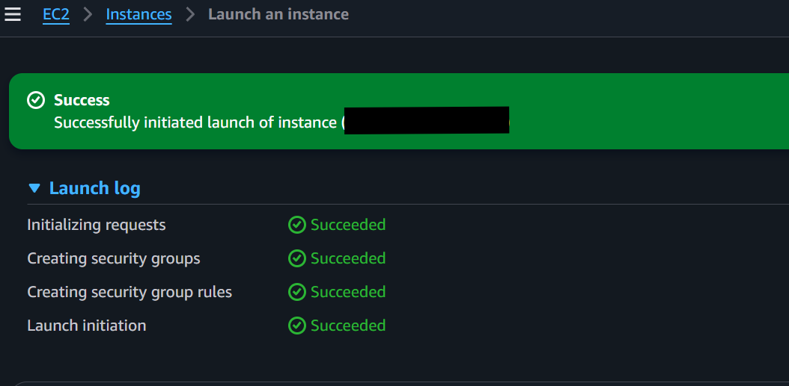
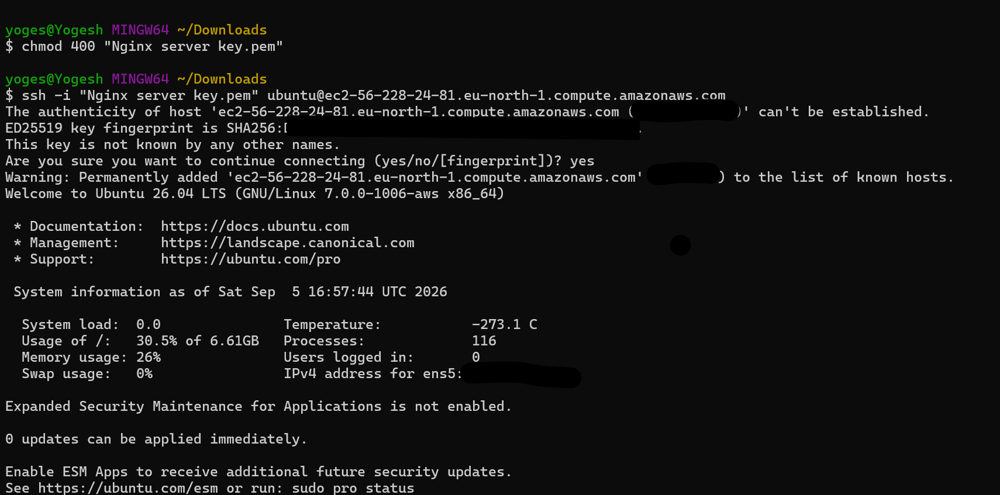
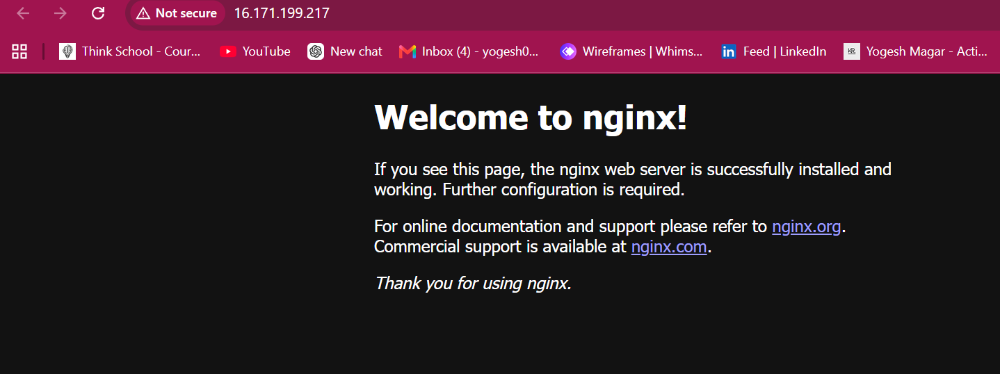
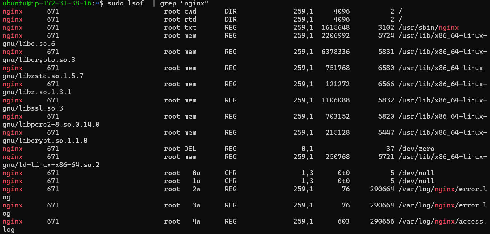

## successfully created EC2

## SSH connection to your server

## Nginx welcome page accessible from browser

## Log file contents

## commands used
- sudo apt update && apt upgrade
- sudo apt-get install nginx -y
- systemctl status nginx
- scp -i "Nginx server key.pem" ubuntu@16.171.199.217:/home/ubuntu/notes.log .
