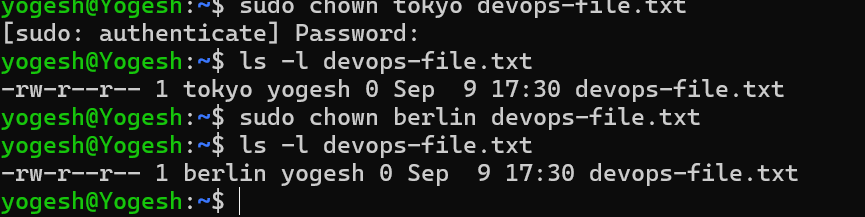
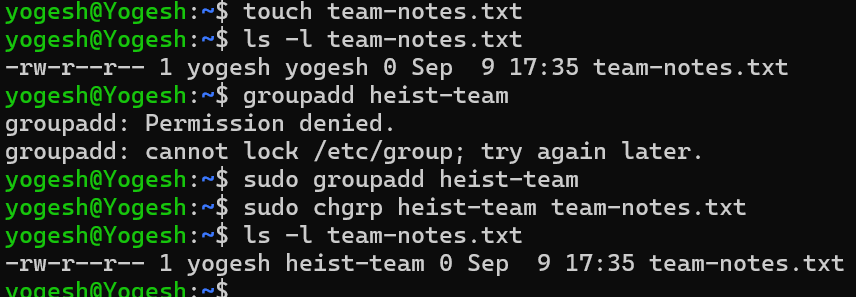
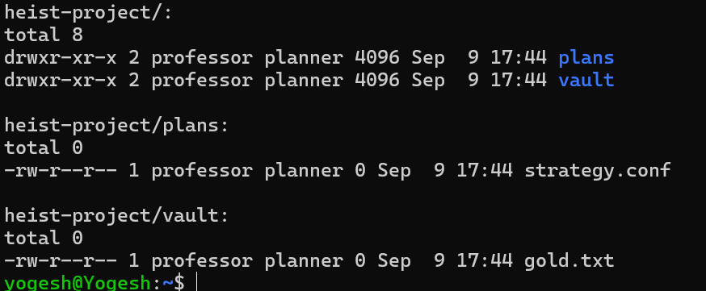
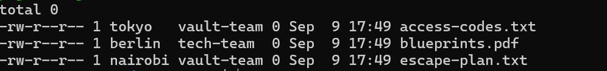

## What's the difference between owner and group?
#### Owner is the individual user who own the file or directory whereas the group is team of individuals who have same level of access for that file or folder.

 

