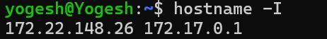
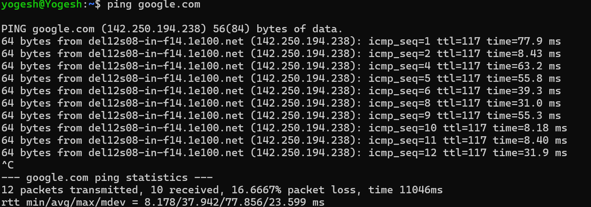
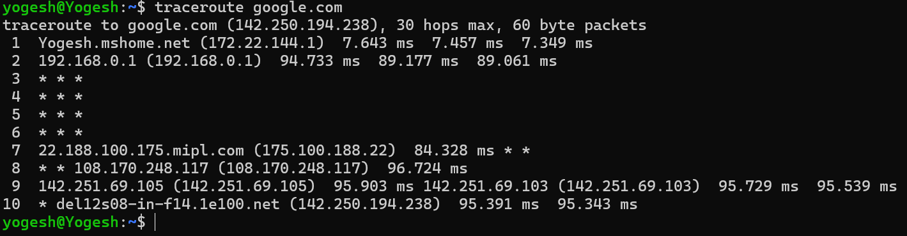
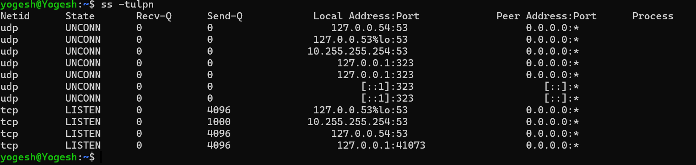
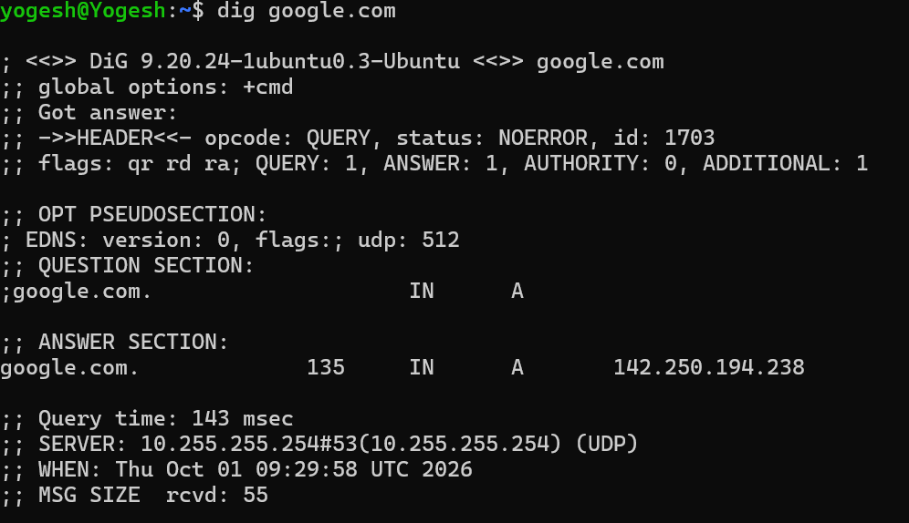
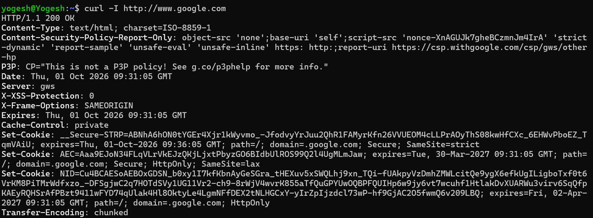
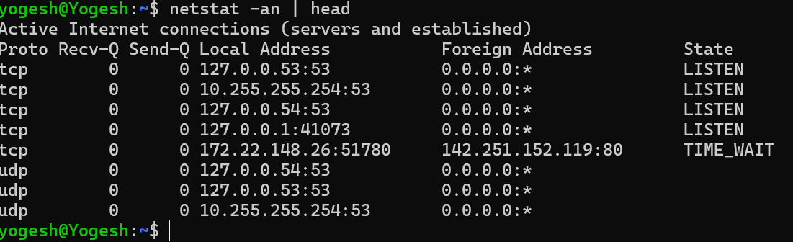

hostname -I

Which command gives you the fastest signal when something is broken?
ANS: curl command is the give fastest signal when something is broken. curl give response code lik 200 for ok , 400,404 etc using these response code we can identify what is wrong.

What layer (OSI/TCP-IP) would you inspect next if DNS fails? If HTTP 500 shows up?
ANS: If http 500 shows up we should inspect OCI layer which is layer 7. and if DNS fails then we have to check for layer 4.

Two follow-up checks you’d run in a real incident.
ANS: I would check systemctl for if service is running properly and then check for error logs.